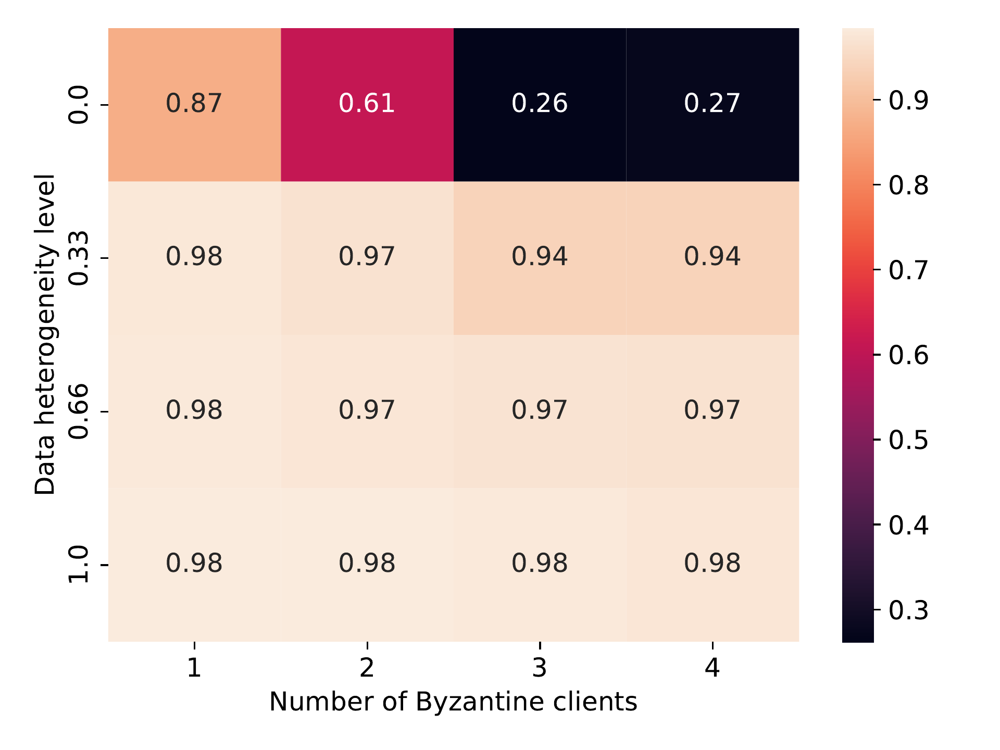

.. _federated_learning-label:

FL Benchmark
=================================

The **FL Benchmark** in ByzFL is a **comprehensive testing framework** for evaluating federated learning algorithms under adversarial conditions. It automates large-scale experiments, allowing users to test various **aggregators, attacks, and data heterogeneity levels** through a single **configurable JSON file**.

This benchmark extends the :ref:`federated-learning-framework-label` by enabling **systematic evaluation** rather than manual experiment setup. 

Key Features
------------

- **Fully Configurable via JSON**  
  
  Define federated learning scenarios (e.g., aggregators, attacks, data heterogeneity) though a single configuration file (``config.json``), without modifying code.

- **Scalable Benchmarking**  
  
  Run exhaustive simulations with multiple configurations in parallel, automatically storing and analyzing results.

- **Robust Evaluation**  
  
  Automatically identify the best hyperparameter settings by testing aggregators **against the worst-case Byzantine attack**.

- **Prebuilt Visualizations**

  Easily generate plots (**test accuracy curves**, **heatmaps**) to quickly assess performance and compare 
  methods across different configurations.

Pipeline
---------

1. **Run All Configurations and Store Results**
    - Executes federated learning simulations using predefined configurations.
    - Supports parallel execution across multiple settings.

2. **Evaluate the Results**
    - Assesses robustness against **various attacks**.  
    - Identifies optimal learning hyperparameters for each aggregator.

3. **Generate Plots**
    - Produces **accuracy curves, heatmaps, and aggregated performance summaries**.  
    - Facilitates easy comparison of robust aggregators across different federated settings.
   

Why This FL Benchmark?
-----------------------------

The FL Benchmark automates **large-scale federated learning evaluations**, unlike the :ref:`federated_learning-sim-label`, which focuses on single-instance experiments.

It enables exhaustive testing across multiple configurations, including:
    ✔ Varying numbers of honest vs. Byzantine clients
    ✔ Different levels of data heterogeneity (IID vs. non-IID distributions)
    ✔ Multiple aggregation and pre-aggregation strategies
    ✔ Multiple Byzantine attack strategies

By modifying only the ``config.json`` file, users can can fully customize the environment and launch extensive experiments without writing additional code.

Setting Up Your Experiments
---------------------------
All experiments are set up using a single JSON configuration file (``config.json``), placed in the working directory.
Below is a sample of a ``config.json`` file, testing the strength of state-of-the-art robust aggregators in an adversarial distributed setup.

.. admonition:: Click to expand JSON configuration
    :class: toggle

    .. code-block:: json

        {
            "benchmark_config": {
                "training_algorithm": {
                    "name": "DSGD",
                    "parameters": {}
                },
                "nb_steps": 800,
                "training_seed": 0,
                "nb_training_seeds": 3,
                "nb_honest_clients": 10,
                "f": [1, 2, 3, 4],
                "data_distribution_seed": 0,
                "nb_data_distribution_seeds": 1,
                "data_distribution": [
                    {
                        "name": "gamma_similarity_niid",
                        "distribution_parameter": [1.0, 0.66, 0.33, 0.0]
                    }
                ],
            },
            "model": {
                "name": "cnn_mnist",
                "dataset_name": "mnist",
                "nb_labels": 10,
                "loss": "NLLLoss",
                "learning_rate": 0.1,
                "learning_rate_decay": 1.0,
                "milestones": []
            },
            "aggregator": [
                {
                    "name": "GeometricMedian",
                    "parameters": {
                        "nu": 0.1,
                        "T": 3
                    }
                },
                {
                    "name": "TrMean",
                    "parameters": {}
                }
            ],
            "pre_aggregators": [
                {
                    "name": "Clipping",
                    "parameters": {}
                },
                {
                    "name": "NNM",
                    "parameters": {}
                }
            ],
            "honest_clients": {
                "momentum": 0.9,
                "weight_decay": 0.0001,
                "batch_size": 25
            },
            "attack": [
                {
                    "name": "SignFlipping",
                    "parameters": {}
                },
                {
                    "name": "Optimal_InnerProductManipulation",
                    "parameters": {}
                },
                {
                    "name": "Optimal_ALittleIsEnough",
                    "parameters": {}
                }
            ],
            "evaluation_and_results": {
                "evaluation_delta": 50,
                "store_per_client_metrics": true,
                "store_models": false,
                "results_directory": "./results"
            }
        }

**This setup:**  
    - Runs experiments on **MNIST** with **10 honest clients** and **1 to 4 Byzantine clients** with **Distributed Stochastic Gradient Descent** (DSGD).
    - Evaluates **non-IID data distributions**.
    - Executes the :ref:`trmean-label` & :ref:`gm-label` aggregators, pre-composed with :ref:`clipping-label` and :ref:`nnm-label`.
    - Executes the :ref:`sf-label`, :ref:`opt-alie-label`, and :ref:`opt-ipm-label` attacks.

The FL Benchmark allows users to configure a wide range of parameters, enabling flexible experimentation with different federated learning scenarios.

    - **Dataset**: Choose the dataset for training (e.g., MNIST, CIFAR-10).
    - **Model**: Select the neural network architecture for federated learning.
    - **Number of Honest Clients**: Specify the number of honest clients in the system.
    - **Number of Byzantine Clients**: Specify the number of adversarial clients in the system.
    - **Data Distribution**: Configure the data heterogeneity across clients (IID, non-IID distributions).
    - **Aggregators**: Test different aggregation methods (e.g., Trimmed Mean, Geometric Median). *(Hyperparameters must be specified separately.)*
    - **Pre-aggregators**: Select pre-processing techniques applied before aggregation (e.g., Clipping, Nearest Neighbor Mixing). *(Hyperparameters must be specified separately.)*
    - **Attacks**: Simulate different Byzantine attack strategies (e.g., Sign Flipping, ALIE, Inner Product Manipulation). *(Hyperparameters must be specified separately.)*
    - **Learning Rate**: Define the learning rate for model training.
    - **Client Momentum**: Adjust the momentum value for client-side optimization.
    - **Weight Decay**: Set the weight decay factor to control regularization.

.. note::
   - You can specify a list of values for any supported parameter in ``config.json``. Each entry in the list is treated as a separate simulation.
   - Not all variables support lists. Using a list for an unsupported parameter may overwrite previous results.
   - The `f` parameter must not be explicitly provided to (pre-)aggregators or attacks that require it in their parameters, as it is already determined based on the values of the main `f` parameter in ``config.json``.

Supported Federated Learning Algorithms
~~~~~~~~~~~~~~~~~~~~~~~~~~~~~~~~~~~~~~~~~

ByzFL supports two main federated learning algorithms Federated Averaging (FedAvg) and Distributed Stochastic Gradient Descent (DSGD).

- **FedAvg**: A foundational algorithm in federated learning that performs local training on each client for multiple epochs and then averages the resulting model updates on the server. It is communication-efficient and widely used in practice.
- **DSGD**: A distributed variant of stochastic gradient descent where clients compute local gradients (often using mini-batches) and send them to the server for aggregation at each iteration. Unlike FedAvg, DSGD operates at the level of gradients rather than model weights and is often used as a base for analyzing the theoretical robustness of gradient-based robust aggregators in adversarial settings.

To choose your desired algorithm, specify the `benchmark_config` in the `config.json` file:

.. code-block:: json

    "training_algorithm": {
        "name": "FedAvg",
        "parameters": {
            "proportion_selected_clients": 0.6,
            "local_steps_per_client": 5
        }
    }

    "training_algorithm": {
        "name": "DSGD",
        "parameters": {}
    }

Launching the Benchmark
---------------------------

To execute the benchmark, simply run:

.. code-block:: python

    from byzfl.benchmark import run_benchmark

    if __name__ == "__main__":  # Required for multiprocessing
        n = 1  # Number of trainings to run in parallel
        run_benchmark(n)

- The benchmark automatically reads ``config.json`` and executes all specified experiments.  
- Results are stored in the ``results_directory`` (default: ``./results``).  
- If no ``config.json`` file exists in your current directory, **a default template is generated** for customization. You can modify this file before re-running the benchmark.

``run_benchmark()`` provides a built-in evaluation function that automatically selects the best hyperparameters by assessing **worst-case attack scenarios**.
Specifically, it evaluates various provided hyperparameters, such as **learning rates, client momentum, and weight decay**, and determines the configuration that achieves the **highest worst-case accuracy** on a validation set against the **strongest Byzantine attack** (i.e., the attack that minimizes the best achievable accuracy).
This approach ensures that the selected hyperparameters maximize **robustness** while preventing overfitting to the test set.

Viewing Results
-------------------

ByzFL provides **built-in visualization tools** to analyze results.

**Test Accuracy Curves**
************************

Displays **test accuracy trends over time** for each aggregator across different attack strategies.
Each aggregator is represented by a plot containing accuracy curves for all considered attacks.

.. code-block:: python

    from byzfl.benchmark.evaluate_results import test_accuracy_curve

    path_training_results = "./results"
    path_to_plot = "./plot"

    test_accuracy_curve(
        path_training_results, 
        path_to_plot
    )

Example Plot
^^^^^^^^^^^^

For ``nb_honest_clients=10``, ``f=2``, ``distribution parameter = 0.0``, ``aggregator = Trimmed Mean``:

.. image:: ../../_static/plots_example/mnist_cnn_mnist_n_12_f_2_d_2_gamma_similarity_niid_0.0_TrMean_Clipping_NNM_lr_0.1_mom_0.9_wd_0.0001_plot.png
   :alt: Example Accuracy Plot
   :scale: 35%
   :align: center

**Heatmaps**
************

Heatmaps summarize performance across multiple configurations.  

- **X-axis:** Number of Byzantine clients  
- **Y-axis:** Data heterogeneity (distribution parameter)  
- **Cell Value:** Worst-case test accuracy or training loss under the strongest attack 

Heatmap of training losses
^^^^^^^^^^^^^^^^^^^^^^^^^^

.. code-block:: python

    from byzfl.benchmark.evaluate_results import loss_heatmap

    path_training_results = "./results"
    path_to_plot = "./plot"

    loss_heatmap(path_training_results, path_to_plot)

.. container:: image-row

    .. container:: image-column

        **Geometric Median (Loss)**

        .. image:: ../../_static/plots_example/GM_heatmap_loss.png
           :alt: Geometric Median Heatmap Loss
           :scale: 20%
           :align: center

    .. container:: image-column

        **Trimmed Mean (Loss)**

        .. image:: ../../_static/plots_example/TM_heatmap_loss.png
           :alt: Trimmed Mean Heatmap Loss
           :scale: 20%
           :align: center

Heatmap of test accuracies
^^^^^^^^^^^^^^^^^^^^^^^^^^^

.. code-block:: python

    from byzfl.benchmark.evaluate_results import test_heatmap

    path_training_results = "./results"
    path_to_plot = "./plot"

    test_heatmap(path_training_results, path_to_plot)

.. container:: image-row

    .. container:: image-column

        **Geometric Median (Test Accuracy)**

        .. image:: ../../_static/plots_example/GM_test_heatmap.png
           :alt: Geometric Median Heatmap Test Accuracy
           :scale: 20%
           :align: center

    .. container:: image-column

        **Trimmed Mean (Test Accuracy)**

        .. image:: ../../_static/plots_example/TM_test_heatmap.png
           :alt: Trimmed Mean Heatmap Test Accuracy
           :scale: 20%
           :align: center

Aggregated heatmap of test accuracies
^^^^^^^^^^^^^^^^^^^^^^^^^^^^^^^^^^^^^

This plot consolidates all (pre-)aggregators, showing **the best-performing method per scenario (cell)**.

.. code-block:: python

    from byzfl.benchmark.evaluate_results import aggregated_test_heatmap

    path_training_results = "./results"
    path_to_plot = "./plot"

    aggregated_test_heatmap(
        path_training_results,
        path_to_plot
    )

The aggregated view of Geometric Median and Trimmed Mean shows the accuracy achieved by the best method in each configuration:

Extending the Benchmark
-----------------------

ByzFL is **fully extendable**, allowing users to integrate custom **(pre-)aggregators, attacks, and models**. There are two options:

1. Modify the code within the installed library.
2. Clone the ByzFL repository, make changes, and then run it:

.. code-block:: console

    git clone https://github.com/LPD-EPFL/byzfl.git

**Example: Adding a Custom Aggregator**
****************************************

To add a new aggregation method:

1. Navigate to ``byzfl/aggregators/aggregators.py``.
2. Implement a class with a constructor (`__init__`) and an aggregation method (`__call__`).
3. Register the new aggregation in the `config.json` file.

Example:

.. code-block:: python

    class CustomAggregator:
        def __init__(self, param1, param2):
            self.param1 = param1
            self.param2 = param2

        def __call__(self, vectors):
            return some_aggregation_function(vectors)

Once implemented, update `config.json`:

.. code-block:: json

    "aggregator": {
        "name": "CustomAggregator",
        "parameters": {
            "param1": 0.5,
            "param2": 2
        }
    }